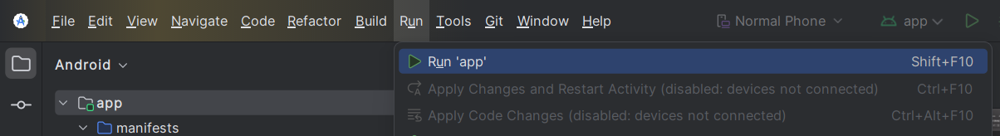

# Login Me

> **⚠️ Note:**  
> Login Me is a demo project for a college assignment and is **not production-ready**.

## Overview

**Login Me** is a learning platform built using Kotlin and Jetpack Compose. It demonstrates features like user registration, login, and browsing a course catalog.

## Requirements

Before you begin, make sure you have the following tools:

1. **Android Studio**  
   The official development environment for Android apps.  
   👉 [Installation Guide](https://developer.android.com/codelabs/basic-android-kotlin-compose-install-android-studio)

2. **Android SDK (API Level 14)**  
   Tools required to develop Android applications.  
   👉 [SDK Installation Guide](https://developer.android.com/about/versions/14/setup-sdk)

3. **Git** (optional)  
   Use Git to clone the repository if you're not downloading it directly.

## Getting Started

Follow these steps to set up and run the application:

1. **Clone the Repository**  

   Run this command in your terminal to download the project:

   ```bash
   git clone https://github.com/michaelact/loginme
   cd loginme
   ```

2. **Build and Run the Application**  

   Open the project in Android Studio and run the app on an emulator or connected device.  
   

3. **Use the Application**  

   Watch this demo video to see how it works:  
   [](https://www.youtube.com/shorts/uO3grD3d9PY)

   > **Default Login Credentials:**  
   > - **Email:** `pengguna`  
   > - **Password:** `masuk`  

   Use these credentials to log in and access the course catalog.

## Design Inspiration

The app design is inspired by the following shots:  
👉 [Dribbble - Online Course App Design](https://dribbble.com/shots/21113101-Online-Course-App-Onboarding-Login-Register-Forgot-Password)
